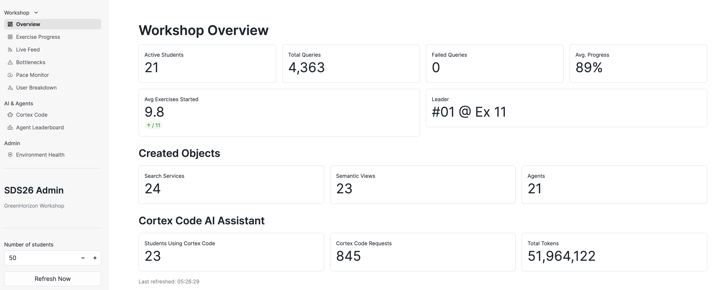
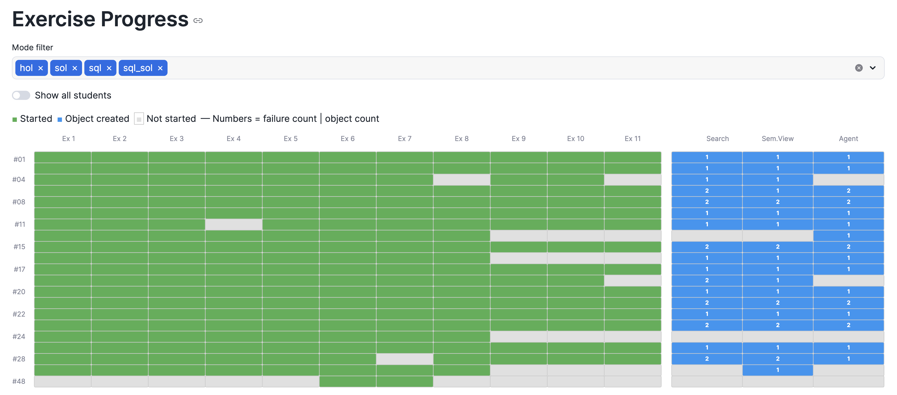
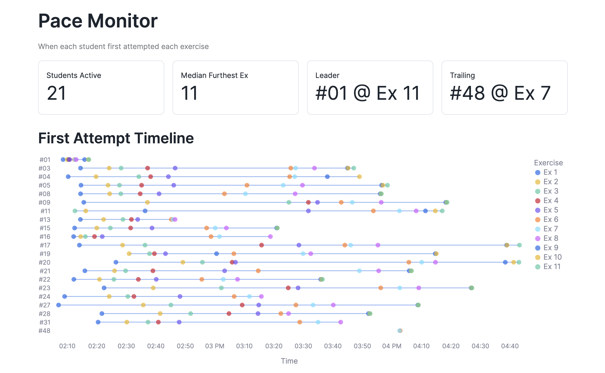
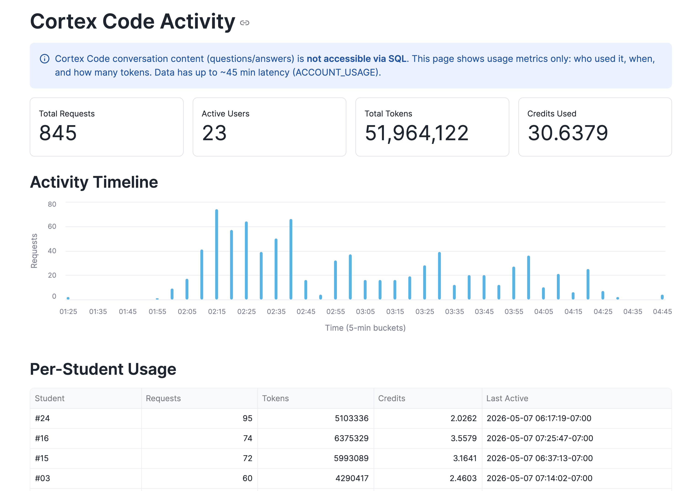

# create-tutor

Meta-skill that generates an AI tutor for any [Cortex Code](https://docs.snowflake.com/en/user-guide/cortex-code/cortex-code) workshop — graduated hints, error triage, solution validation, and progress tracking — from your existing workshop content. This skill creates tutor infrastructure; it does not tutor students directly.

## Quick Start

Open a Cortex Code session in your workshop repository and run:

```
$create-tutor Create a tutor for this workshop
```

The skill explores your repo, discovers exercises and solutions, and generates everything. No YAML to write, no folder conventions to follow.

## How It Works

```
Your workshop repo          $create-tutor              Generated infrastructure
─────────────────          ─────────────              ────────────────────────
 *.ipynb                     ANALYZE                   tutor/SKILL.md
 solutions/          ──►    (explore repo)     ──►    AGENTS.md
 sql/*.sql                   GENERATE                  workshop.yaml
 README.md                  (produce files)
```

### Three Modes

| Mode | When | What It Does |
|------|------|-------------|
| **ANALYZE** | First run | Explores your repo with Glob/Grep/Read to discover exercises, solutions, and structure |
| **GENERATE** | After analysis approved | Produces tutor SKILL.md, AGENTS.md, and workshop.yaml with AI-generated hints |
| **EVOLVE** | After content changes | Re-explores, diffs against existing manifest, updates only what changed |

Every mode pauses for your review before writing files.

### What Gets Generated

| File | Purpose |
|------|---------|
| `.snowflake/cortex/skills/tutor/SKILL.md` | Participant-facing tutor with graduated hints (L1 concept → L2 structure → L3 solution) |
| `AGENTS.md` | Routes "fix the error" and "check my solution" requests to the tutor |
| `workshop.yaml` | Machine checkpoint so EVOLVE can track changes |

## The Graduated Hint Ladder

The generated tutor teaches participants through three levels of support, based on research in scaffolded learning (Vygotsky's Zone of Proximal Development, validated by DBox at CHI 2025):

| Level | What the Participant Sees | When |
|-------|--------------------------|------|
| **L1 — Concept** | "This function takes a file reference and extracts text. Use `TO_FILE()` to point to your stage." | First ask |
| **L2 — Structure** | `AI_PARSE_DOCUMENT(TO_FILE('@stage', '<path>'), {'mode': 'LAYOUT'})` | Second ask |
| **L3 — Solution** | Complete working SQL with explanation | Third ask or explicit request |

The tutor never gives the full answer on the first ask (unless the participant explicitly requests it), and never executes code for them.

### Error Triage

The tutor automatically distinguishes between:
- **Exercise cells** (where participants write code) → coached with graduated hints
- **Setup/infrastructure cells** → fixed directly, no coaching needed

This means the "Fix" button in Snowsight notebooks routes through the tutor for exercise cells, preserving the learning opportunity.

### Solution Validation

Participants can ask "Did I solve this correctly?" and the tutor compares their code against the reference solution, giving feedback without rewriting their code.

## What a Tutored Workshop Looks Like

The screenshots below show a real workshop with 21 active students and 11 exercises, powered by the tutor infrastructure this skill generates.

### Workshop Overview

Real-time dashboard showing student activity, progress, and AI assistant usage.



### Exercise Progress

Heatmap tracking which exercises each student has started (green), completed with object creation (blue), or not yet attempted (grey).



### Pace Monitor

Timeline showing when each student first attempted each exercise — helps instructors identify who's ahead and who needs help.



### Cortex Code Activity

Monitoring AI assistant usage: request volume over time, per-student token consumption, and total usage metrics.



## Works With Any Structure

The skill uses agentic exploration (the same Glob → Grep → Read pattern that powers Cortex Code itself) rather than assuming specific folder conventions. It works with:

- Multi-notebook workshops with separate solution directories
- Single-notebook workshops with inline exercises
- SQL worksheet-based workshops
- Notebooks generated from build scripts
- Any combination of the above

If the structure is ambiguous, the skill asks you.

## Requirements

- [Cortex Code](https://docs.snowflake.com/en/user-guide/cortex-code/cortex-code) (or compatible AI coding assistant)
- A workshop with exercises (notebooks or SQL files with `-- YOUR CODE HERE` or similar markers)
- Optionally: solution files for L3 hints and validation

## Installation

Add from this repository:

```
/skill add https://github.com/anthu/agent-skills.git/create-tutor
```

Or add all skills:

```
/skill add https://github.com/anthu/agent-skills.git
```

## Example Session

```
You: $create-tutor Create a tutor for this workshop

AI:  Let me explore your workshop repository...
     [runs Glob, Grep, Read across the repo]

     Workshop Analysis Report
     ========================
     Found 3 notebooks, 11 exercises across 3 modules:

     Module 1: Explore & Parse (hol_01, exercises 1-5)
       Ex 1: ex1_json — JSON colon notation
       Ex 2: ex2_parse — AI_PARSE_DOCUMENT
       ...

     Solutions: 11/11 matched
     Progress Tracking: QUERY_TAG detected

     Does this look correct?

You: Yes, looks good. Generate the tutor.

AI:  [generates tutor SKILL.md, AGENTS.md, workshop.yaml]

     Generation Report
     =================
     Files Generated:
       1. .snowflake/cortex/skills/tutor/SKILL.md
       2. AGENTS.md
       3. workshop.yaml

     --- AI-Generated Hints (review recommended) ---
     Exercise 1: JSON Colon Notation
       L1: "JSON is loaded as a VARIANT. Use : to navigate..."
       L2: SELECT $1:field::STRING FROM @stage/file.json
       L3: [full solution from solutions/]
     ...

You: Exercise 4 hint is too vague. Make it more specific about
     the AI_COMPLETE prompt structure.

AI:  [EVOLVE mode — updates Exercise 4 hints]
```
